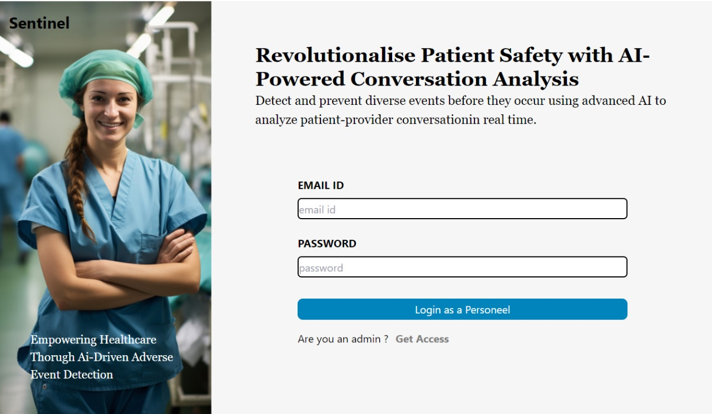
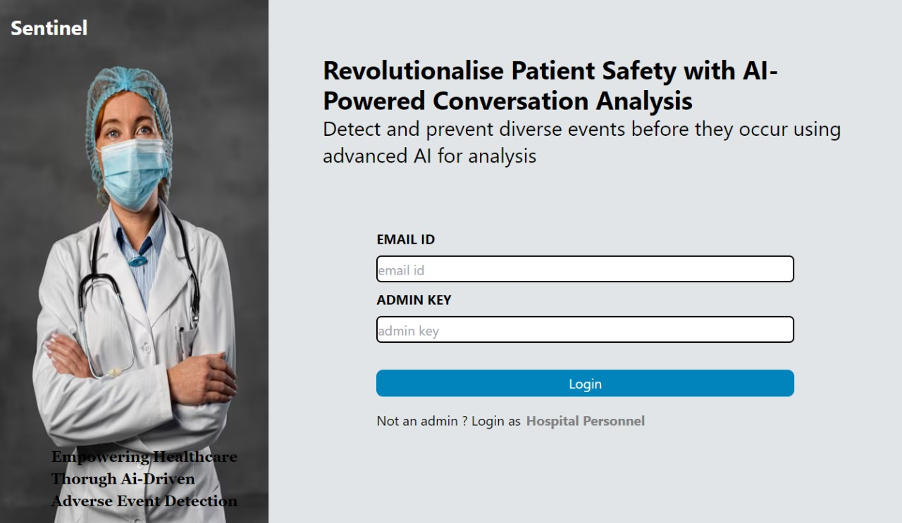

# Adverse Event Analysis WebApp

## Overview

This application is designed to analyze recorded conversations between patients and medical agents/nurses to identify and predict potential adverse events. The application converts call recordings into text, performs adverse event detection, and analyzes sentiments of patient to provide actionable insights.

This prototype is built for VEERSA HACKATHON – MSIT BATCH OF 2025 by **Team Strawhats**.

**Members:**

- Sanchit Baweja
- Yash Tyagi
- Pranav Kumar
- Mridul Saggi

## Problem Statement

**Adverse Medical Event Prediction from a Phone Call**

Millions of conversations happen between medical agents/nurses and patients every day regarding their medical conditions and medications. While the patients or nurses might not realize, there might be indications of an adverse event which has already occurred or there is a possibility of one occurring. It is critical to identify and flag such possible adverse events quickly and accurately to prevent the same from occurring or to remediate the one that has happened already.

## Features

- **Speech-to-Text Conversion:** Converts audio recordings into text for analysis.
- **Adverse Event Detection:** Identifies potential adverse events based on the text.
- **Sentiment Analysis:** Analyzes the sentiment of the patient at different points in the conversation.
- **User Interface:** Web-based interface for uploading audio files and viewing analysis results.

 ## 🎨 Figma Design

Our project's user interface and experience are crafted using Figma. The Figma design file serves as the blueprint for our application's layout, visual elements, and interactions.

### 📁 Figma Design File

You can access the Figma design file here:

[Figma Design Link](https://www.figma.com/design/5hCEObASv7akoJSJ3dwXJD/Veersa---Sentinal?node-id=0-1&t=f37xa9kz7Ek5m9K0-1)

### Demo Video
[Demo Video Link](https://drive.google.com/file/d/1NWfRc4YwZ5v1f4UY3GLTguQnL1iUJDwV/view?usp=sharing)

## User Interface

Here are some screenshots of the user interface:

## Links

**Ml API:** API for speech to text conversion of phone call and adverse event analysis [View API](https://veersa-hack.onrender.com/transcribe)
**Deployed Application:** Check out the live application here. [Access Deployed App]()

## Getting Started

### Prerequisites

### Installation

### Usage
## Documentation

The detailed requirements and system specifications are available in the [`docs/Requirements Analysis Document.pdf`] file.

## License

This project is licensed under the MIT License - see the [LICENSE](LICENSE) file for details.

